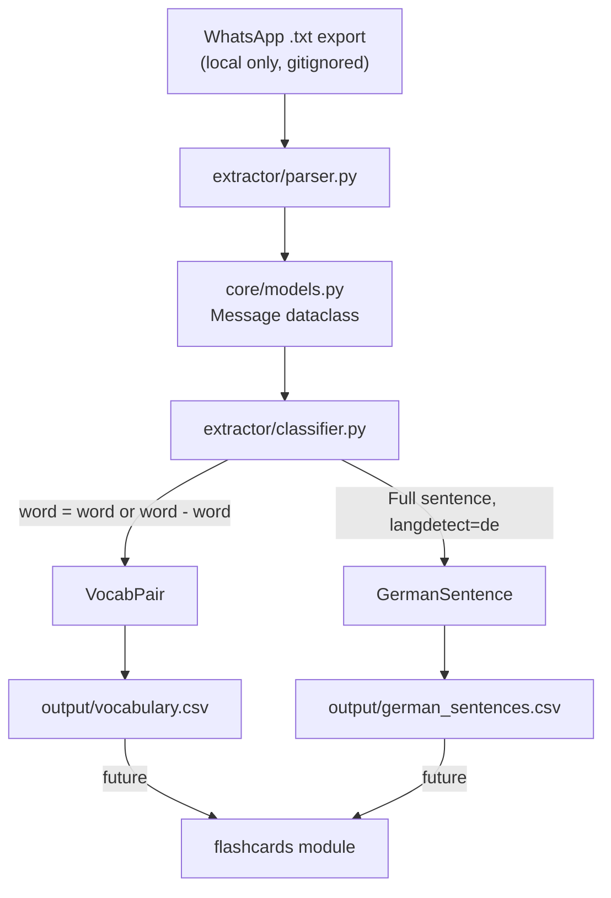

# German Notes Picker

## Architecture




## Project Structure

```
German_notes_picker/
├── .gitignore                  # excludes data/ folder entirely
├── pyproject.toml              # Poetry config
├── poetry.lock
├── README.md
├── data/                       # gitignored — put your .txt file here
├── output/
│   ├── vocabulary.csv          # committed
│   └── german_sentences.csv    # committed
└── german_notes/               # main Python package
    ├── __init__.py
    ├── core/
    │   ├── __init__.py
    │   └── models.py           # Message, VocabPair, GermanSentence dataclasses
    ├── extractor/
    │   ├── __init__.py
    │   ├── parser.py           # WhatsApp German-locale line parser
    │   ├── classifier.py       # vocab pair + sentence classifiers
    │   └── cli.py              # entry point, writes CSVs
    └── flashcards/             # future module (placeholder)
        └── __init__.py
```

## Key Implementation Details

### 1. Shared Models (`core/models.py`)

These dataclasses are the shared contract between `extractor` and future modules like `flashcards`:

```python
@dataclass
class Message:
    date: str
    sender: str
    text: str

@dataclass
class VocabPair:
    german: str
    translation: str
    translation_lang: str   # 'es' or 'en'
    date: str
    sender: str
    raw_message: str

@dataclass
class GermanSentence:
    sentence: str
    date: str
    sender: str
```

### 2. WhatsApp Line Parsing (`extractor/parser.py`)

The export uses **German locale** format (confirmed from the actual file):

`DD.MM.YY, H:MM abends/mittags/nachm./nachts/morgens/vorm. - Sender: message`

```python
LINE_RE = re.compile(
    r'^(\d{2}\.\d{2}\.\d{2}),\s+\S+\s+\S+\s+-\s+([^:]+):\s+(.+)$'
)
```

System messages (e.g. `<Medien ausgeschlossen>`, encryption notices, URLs) are skipped.

### 3. Message Classification (`extractor/classifier.py`)

**Vocab pair detector** — separators observed in the actual chat are `=` and `-`:

```python
SEPARATOR_RE = re.compile(r'^(.+?)\s*[=\-]\s*(.+)$')
```

After splitting, `langdetect` identifies which side is German (`de`) and which is Spanish (`es`) or English (`en`). Either side can be German — the classifier normalizes so `german` is always the German term. Typos are preserved as-is for manual review.

**German sentence detector** — flagged when:

- Message does NOT match the vocab pair pattern
- Word count ≥ 4
- `langdetect` returns `de`

### 4. Output CSVs

`vocabulary.csv`: `german`, `translation`, `translation_lang`, `date`, `sender`, `raw_message`

`german_sentences.csv`: `sentence`, `date`, `sender`

### 5. Privacy / Git

`.gitignore` excludes the entire `data/` folder. Only `output/` CSVs are committed.

## Dependencies

Managed via Poetry:

- `langdetect` — language identification

## Setup & Usage

```bash
poetry install
poetry run python -m german_notes.extractor.cli --input data/"WhatsApp-Chat mit Maja.txt" --output output/
```

